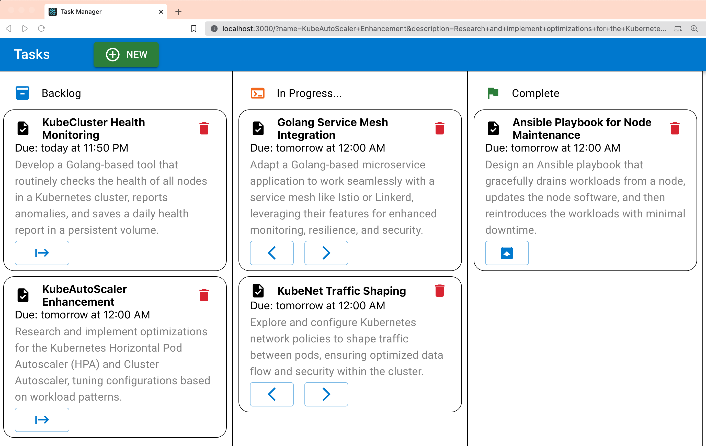
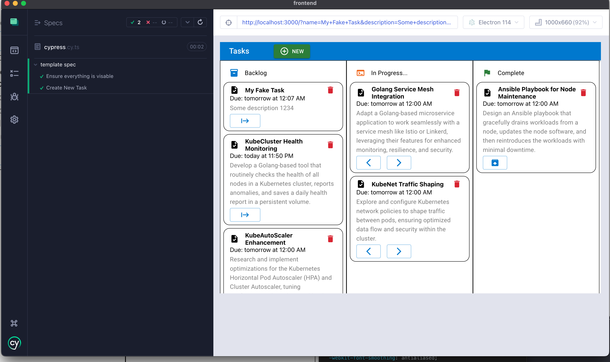

# Task Manager
The Task Service API is a robust solution built on Node.js (Typescript) designed for authorized users to manage and interact with their tasks. It integrates with a Postgres database using Prisma, and the backend framework is Express.

## Docs
- [Design](./DESIGN.md)
- [Frontend](./frontend/README.md)
- [Backend](./backend/README.md)



## Running localy
```bash
# Postgres database
docker compose up -d

# Start the backend
cd ./backend
npm install 
npx prisma migrate dev --name init
npm start
```

In another shell start the frontend
```bash
cd ./frontend
npm install
npm start
```

View the database with
```sh
cd ./backend
npx prisma studio
```

## Testing

- Cypress E2E for the frontend
- Jest for the backend

Both can be run with `npm run test`



